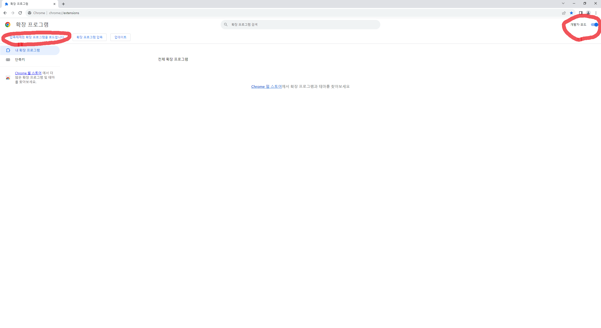
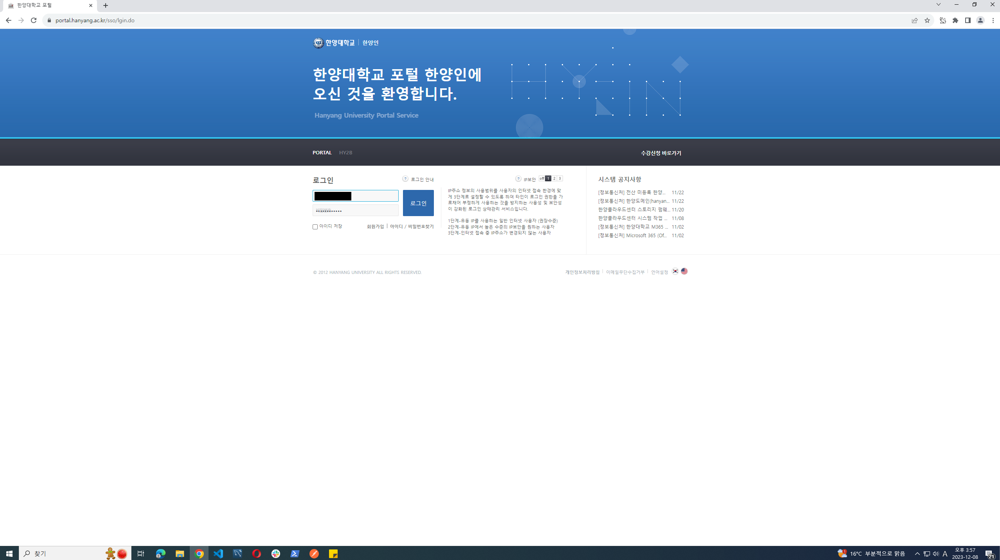
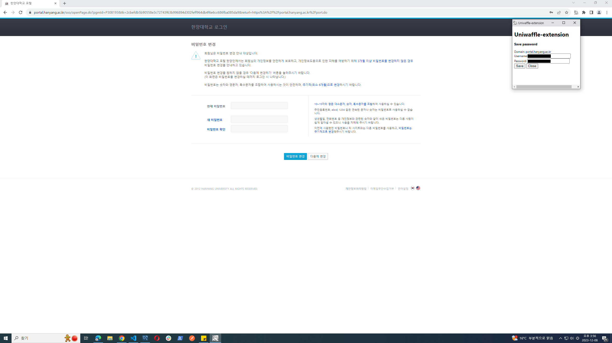

# README

# Uniwaffle-extension

Chrome extension for password manaing and autofill

## Environment

Google Chrome

## How to use

1. Download this repository
2. Open google chrome and go to chrome://extensions
3. Enable developer mode by clicking the toggle switch next to **Developer mode**
4. Click load unpacked and select the extension directory

## Result
Waffle-extension captures the login data right before the page unloading.
### 1. Login try

### 2. Capture login data and ask for saving

  
### 3. Automatically autofill the login data after saving

  
## Reference

[[Unsolved.wa 개발기 - 2] chrome extension 시작부터 끝까지 (oopy.io)](https://80000coding.oopy.io/34a2083b-c159-4524-b5f2-750d3ab4fbba)

[크롬 익스텐션에서 데이터를 어떻게 다룰 것인가? (피트스탑과제 – 크롬 익스텐션 개발기) | 우아한형제들 기술블로그 (woowahan.com)](https://techblog.woowahan.com/5900/)